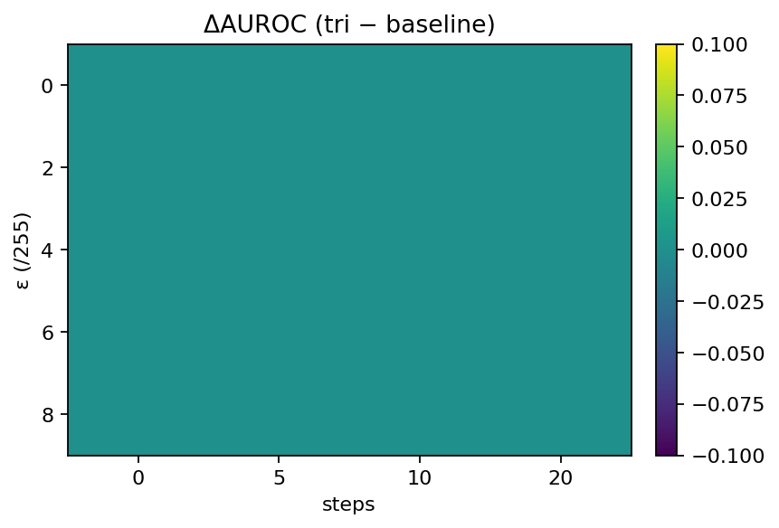
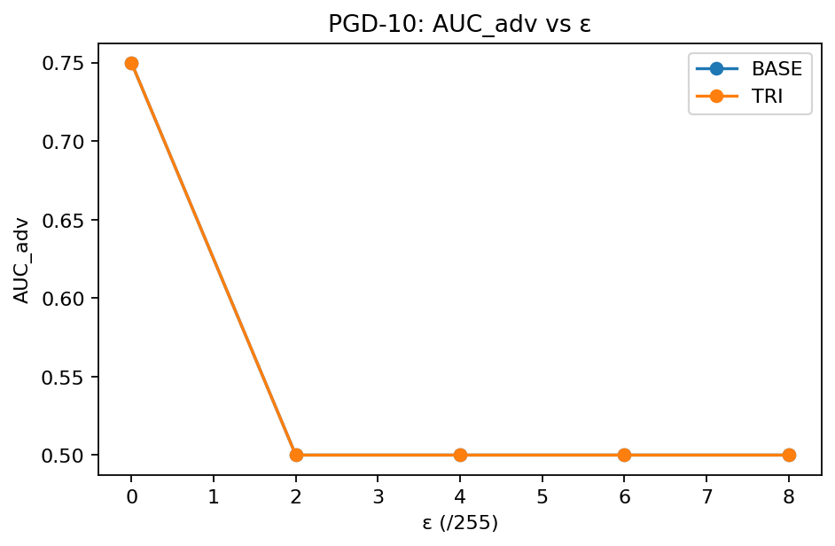

## Debug robustness sweeps (quick start)

Run the tri-objective robustness sweep on the debug split and generate comparison plots vs the baseline.

```powershell
# Use the newest checkpoint in results/checkpoints
# (tries: triobj_best.pt, best.pt, last.pt, best_weights.pt)
powershell -ExecutionPolicy Bypass -File tools\run_debug_sweeps.ps1

# Force recompute and/or point at a specific baseline CSV
powershell -ExecutionPolicy Bypass -File tools\run_debug_sweeps.ps1 -Force -BaseCsv results\metrics\robust_sweep_val_debug.csv

# (Optional) point at a specific checkpoint explicitly
powershell -ExecutionPolicy Bypass -File tools\run_debug_sweeps.ps1 -Ckpt results\checkpoints\triobj_best.pt

## Debug robustness sweeps (quick start)

Run the tri-objective robustness sweep on the debug split and generate comparison plots vs the baseline.

```powershell
# Use the newest checkpoint in results/checkpoints
# (tries: triobj_best.pt, best.pt, last.pt, best_weights.pt)
powershell -ExecutionPolicy Bypass -File tools\run_debug_sweeps.ps1

# Force recompute and/or point at a specific baseline CSV
powershell -ExecutionPolicy Bypass -File tools\run_debug_sweeps.ps1 -Force -BaseCsv results\metrics\robust_sweep_val_debug.csv

# (Optional) point at a specific checkpoint explicitly
powershell -ExecutionPolicy Bypass -File tools\run_debug_sweeps.ps1 -Ckpt results\checkpoints\triobj_best.pt


## Debug robustness sweeps (quick start)

Run the tri-objective robustness sweep on the debug split and generate comparison plots vs the baseline.

```powershell
# Use the newest checkpoint in results/checkpoints
# (tries: triobj_best.pt, best.pt, last.pt, best_weights.pt)
powershell -ExecutionPolicy Bypass -File tools\run_debug_sweeps.ps1

# Force recompute and/or point at a specific baseline CSV
powershell -ExecutionPolicy Bypass -File tools\run_debug_sweeps.ps1 -Force -BaseCsv results\metrics\robust_sweep_val_debug.csv

# (Optional) point at a specific checkpoint explicitly
powershell -ExecutionPolicy Bypass -File tools\run_debug_sweeps.ps1 -Ckpt results\checkpoints\triobj_best.pt

```
```

### Debug sweep outputs

> **Debug takeaways:** Clean AUROC is 0.619. Robustness degrades quickly under white-box attacks—by ε=4–6/255, PGD-10 collapses AUROC (≈0.116 → 0.050), i.e., drops of ~0.50–0.57 vs clean. Use this to guide robustness training and calibration on the full validation set.

**Tri-objective vs baseline (debug split)**  



**Tables & Data**
- Delta table (MD): [robust_compare_delta_table.md](results/metrics/robust_compare_delta_table.md)
- Tri-obj sweep CSV: [robust_sweep_val_debug_triobj.csv](results/metrics/robust_sweep_val_debug_triobj.csv)
- Tri-obj table (MD): [robust_sweep_val_debug_triobj_table.md](results/metrics/robust_sweep_val_debug_triobj_table.md)


rn

### Thesis figures (debug)

- Delta heatmap: `docs/figures/xai_robust_debug_delta_heatmap.png`
- PGD10 comparison: `docs/figures/xai_robust_debug_pgd10.png`


## Results (VAL)
See **docs/RESULTS_VAL.md** for robustness figures and table.


