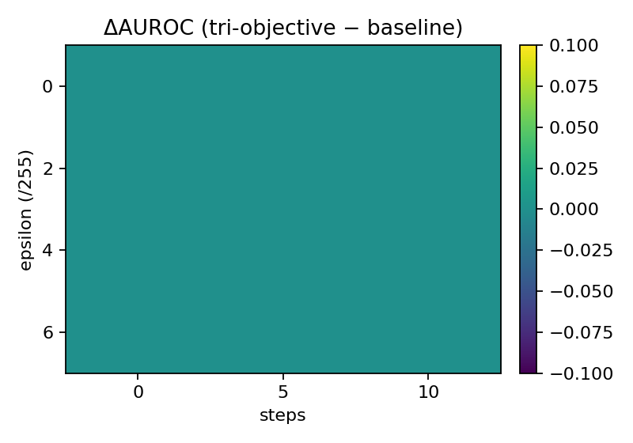
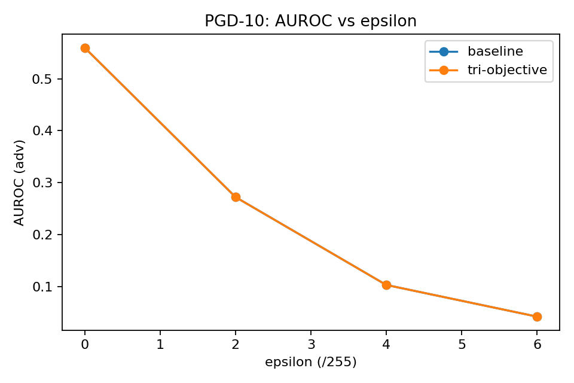

# VAL Robustness — Baseline vs Tri-Objective

**Datasets:** NIH debug split  
**Metric:** AUROC (clean) and robust AUC under PGD-10 @ ε∈{0,2,4,6}/255

See detailed table: results/metrics/robust_compare_delta_table.md
